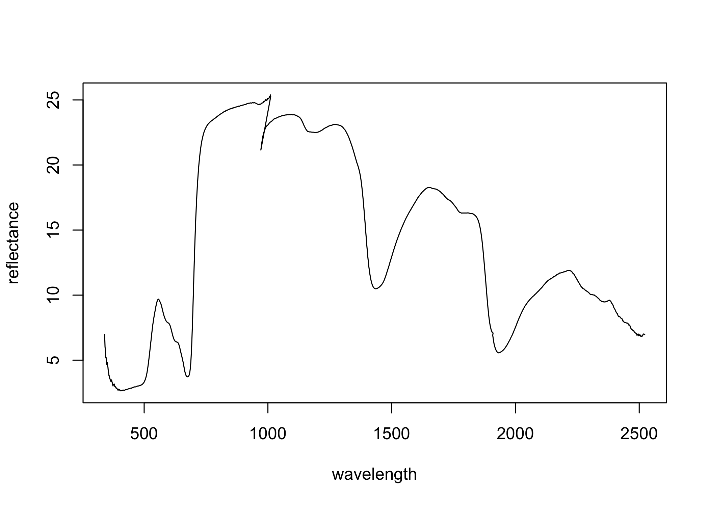
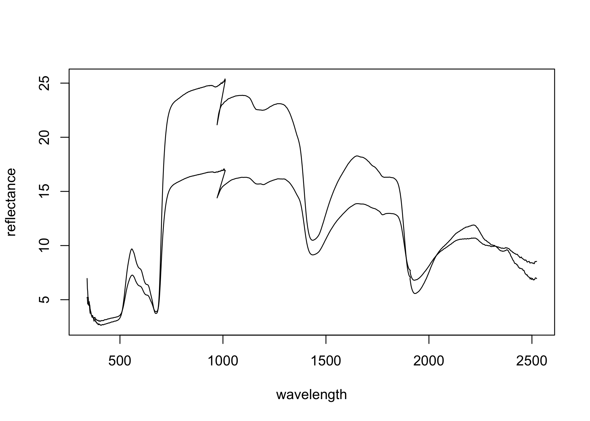

spec Package
============

This test package is meant to help reading and working with `.sig` formatted spectral files in R.

It may become part of the spectral analysis workflow in the [Cavdender-Bares Lab]("https://www.cbs.umn.edu/research/research-cbs/faculty-labs/cavender").

------------------------------------------------------------------------

As of now, you should probably install `spec` from the bitbucket repository. To do, so use:

``` r
library(devtools)

devtools::install_bitbucket(repo      = "cavenderbareslab/spec",
                            auth_user = "your_usr_name",
                            password  = "your_bitbucket_pwd"
                            )
```

Now you should be able to load the package simply by doing

``` r
library(spec)
#> 
#> Attaching package: 'spec'
#> 
#> The following object is masked from 'package:base':
#> 
#>     range
```

To read in sig files, you need to pass the full path of each file in a vector to the function `read_spectra_sig`

``` r
files   = dir("data/", full.names = T)

# File paths
files
#> [1] "data//001.sig" "data//002.sig"

# Read files! This can take some time...
spectra = spec::read_spectra_sig(files)
#> reading 1 out of 2
#> reading 2 out of 2
```

We may have taken a measurement on a white reference (pretending it was a leaf), just to check if the real reference was still accurate (you should see a straight line).

Anyways, we can let `spec` know that we did so by annotating the `spectrum` with a type `leaf` or `blank`. Type `leaf` is the default and the argument is reclycled.

``` r

# If all samples in files are the same type, you don't have to repeat yourself
spectra = spec::read_spectra_sig(files, types = "leaf")
#> reading 1 out of 2
#> reading 2 out of 2

# If samples are different types, you should pass a vector of types of the same
# length as files. Normally you'd be reading this info from a file.
sample_type = c("leaf", "blank")

# Hopefully this is TRUE
length(files) == length(sample_type)
#> [1] TRUE

# Now read the sig files
spectra = spec::read_spectra_sig(files, types = sample_type)
#> reading 1 out of 2
#> reading 2 out of 2
```

You are able to check out basic information / plot each individual spectrum or all the spectra.

``` r
# Check it out
spectra[[1]]
#> spectrum object
#> target: type leaf and reference type: reference
#> file name = se2.3..031515.0089.sig
#> data = 1024 bands in the range [340.5, 2522.8]

# Plot the first spectrum
plot(spectra[[1]])
```



``` r

# ...or all of them
plot(spectra)
```



I feel like the functions above are a quick and dirty way to check out if the `sig` files were read correctly. More often than not, you will want to work with the spectral data in tabular format.

``` r
spec_df = spec::convert_to_data_tables(spectra)
```

The `convert_to_data_tables` function returns a `list` with three `data.frames`: \* `target`. With metadata and spectral values of the target measurement. \* `reference`. Metadata and spectral values of the **unique** reference measurements. \* `reflectance`. The ratio between the `target` and `reference` measurements.

The `target$reference_id`

``` r
spec_df$target[1:2, 1:30]
#>    type              file_name       instrument_model sensor_integ_time1
#> 1  leaf se2.3..031515.0089.sig HI: 1152050 (HR-1024i)                100
#> 2 blank se2.3..031515.0090.sig HI: 1152050 (HR-1024i)                100
#>   sensor_integ_time2 sensor_integ_time3 scan_method sensor_scan_coadds1
#> 1                 20                  4  Time-based                  50
#> 2                 14                  4  Time-based                  50
#>   sensor_scan_coadds2 sensor_scan_coadds3 scan_time sensor_temperature1
#> 1                 219                 740         5                49.3
#> 2                 298                 740         5                49.3
#>   sensor_temperature2 sensor_temperature3 battery_voltage error_code
#> 1                -4.9                -6.8             7.5          2
#> 2                -4.9                -6.8             7.5          0
#>      units           date_time longitude latitude gps_scan_time
#> 1 Radiance 2015-03-15 17:13:21 -85.61155 105.0867        211314
#> 2 Radiance 2015-03-15 17:13:43 -85.61155 105.0867        211336
#>          reference_id  340.5    342  343.4  344.9  346.3  347.8  349.3
#> 1 2015-03-15 16:19:33 453.80 402.90 406.40 378.80 385.99 365.42 375.00
#> 2 2015-03-15 16:19:33 340.35 339.28 325.12 340.92 350.90 348.81 359.38
#>    350.7
#> 1 404.87
#> 2 389.87
```

Known issues and TODOs
----------------------

-   conversion to data frames will break if spectra have different lengths
